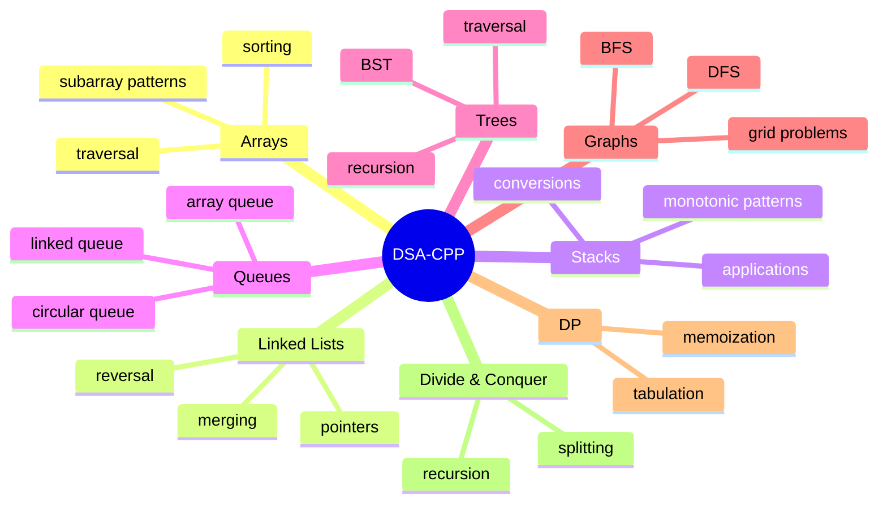

# DSA-CPP


<p align="center">
  
  
  
</p>

> A clean C++ DSA practice repository built for learning, revising, and solving problems topic by topic.

---

## Overview

**DSA-CPP** is a topic-wise collection of data structure and algorithm implementations in C++.  
The repository is structured to help you move from fundamentals to problem-solving with a practical, code-first approach.

It currently includes dedicated sections for:

- **Arrays**
- **Linked Lists**
- **Stacks**
- **Queues**
- **Binary Trees**
- **Graphs**
- **Dynamic Programming**
- **Divide & Conquer**
- **Topic-wise practice files**

At the root level, there are also supporting files such as `DSA.cpp`, `x^n.cpp`, and `ElementaryData.txt`, which add to the learning and practice workflow.

---

## Repository at a Glance

```mermaid
flowchart TD
    A[DSA-CPP] --> B[Array]
    A --> C[LinkedList]
    A --> D[Stack]
    A --> E[Queue]
    A --> F[BinaryTree]
    A --> G[Graph]
    A --> H[DynamicProgramming]
    A --> I[Divide & Conquer]
    A --> J[Topic_Wise]
    A --> K[Root-level practice files]

    B --> B1[Sorting & array tricks]
    B --> B2[Two pointers / subarray problems]
    B --> B3[Classic interview questions]

    C --> C1[Singly linked list]
    C --> C2[Doubly linked list]
    C --> C3[Cycle / reverse / merge]

    D --> D1[Expression conversion]
    D --> D2[Stack applications]
    D --> D3[Monotonic stack problems]

    E --> E1[Linear queue]
    E --> E2[Circular queue]
    E --> E3[Queue using list]

    F --> F1[Traversal & height]
    F --> F2[LCA / diameter / top view]
    F --> F3[BST operations]

    G --> G1[BFS / DFS]
    G --> G2[Cycle detection]
    G --> G3[Flood fill / islands]

    H --> H1[Classic DP problems]
    H --> H2[Optimization patterns]

    I --> I1[Recursive splitting]
    I --> I2[Problem decomposition]
```



---

## What’s Inside

### Array
The `Array` folder contains classic array-based problem solutions and interview-style patterns such as:

- `BubbleSort.cpp`
- `BuySellStock.cpp`
- `ContainerWithMostWater.cpp`
- `Kadans_Algorithm.cpp`
- `Moores_Algorithm.cpp`
- `Pair_Sum.cpp`
- `PeakIdxMountainArray.cpp`
- `ProductofArrayExceptSelf.cpp`
- `Search in a Rotated sorted array.cpp`
- `SingleElementinArray.cpp`
- `removeDuplicates.cpp`

This section is great for building strong fundamentals in traversal, optimization, subarray logic, and array manipulation.

---

### LinkedList
The `LinkedList` folder focuses on singly and doubly linked list operations, including:

- `LinkedListFromArray.cpp`
- `LinkedListPush_front_Back+Pop_Front_Back_Search.cpp`
- `DoublyList.cpp`
- `Reverse.cpp`
- `ReverseRecursion.cpp`
- `ReverseNodesInKGrp.cpp`
- `MergeTwoSorted.cpp`
- `FindMiddle.cpp`
- `DetectRemoveCycle.cpp`
- `InterSection.cpp`
- `SwapNodesInPairs.cpp`
- `copyList.cpp`
- `flattenDoublyList.cpp`

This folder is ideal for understanding pointer manipulation and the core mechanics of linked structures.

---

### Stack
The `Stack` folder includes expression conversion, stack applications, and stack-based optimization problems:

- `StackArray.cpp`
- `StackList.cpp`
- `StackVector.cpp`
- `StackListSTLcpp`
- `ValidParenthesis.cpp`
- `MinStack.cpp`
- `NextGreaterElement.cpp`
- `PreviousSmaller.cpp`
- `StockSpan.cpp`
- `LargestRectangle.cpp`
- `LargestRectangleHistogram.cpp`
- `TrappingRainWater.cpp`
- `InFixToPost.cpp`
- `IntoPre.cpp`
- `PostFixOperation.cpp`
- `PostToIn.cpp`
- `PostToPre.cpp`
- `PreToIn.cpp`
- `PretoPost.cpp`

It is a solid reference for both theory and problem-solving using stack logic.

---

### Queue
The `Queue` folder covers queue implementations in multiple forms:

- `queue.cpp`
- `QueueList.cpp`
- `QueueCircularArray.cpp`

This section helps compare linear and circular queue behavior, along with list-based implementation patterns.

---

### BinaryTree
The `BinaryTree` folder is one of the most comprehensive sections in the repository, containing binary tree and BST-related problems such as:

- `BuildTreeFromPreInOrder.cpp`
- `ArrayToBST.cpp`
- `UnsortedArrayToBST.cpp`
- `Diameter.cpp`
- `Height.cpp`
- `NodeCount.cpp`
- `KthLevel.cpp`
- `Kth Smallest.cpp`
- `Kth Largest.cpp`
- `LowestCommonAncestor.cpp`
- `TopView.cpp`
- `SumNodes.cpp`
- `SameTree.cpp`
- `SubTree.cpp`
- `Root+SubTree.cpp`
- `Root+Greater.cpp`
- `PopulateNextRightPointers.cpp`
- `mergeTwoBST.cpp`
- `PreInPostTraversal.hpp`
- `MinimumDistance.cpp`

This folder is especially useful for mastering recursion, tree traversal, and BST reasoning.

---

### Graph
The `Graph` folder includes core traversal and grid-graph routines:

- `BFS.cpp`
- `DFS.cpp`
- `CycleBFS.cpp`
- `CycleDFS.cpp`
- `FloodFill.cpp`
- `NumberOfIslands.cpp`
- `code.cpp`

This section gives a good foundation for graph search, connectivity, and matrix-based graph problems.

---

### DynamicProgramming
The `DynamicProgramming` folder is dedicated to DP-based solutions and optimization thinking.  
It is a good place for revisiting subproblem structure, memoization, and tabulation techniques.

---

### Divide & Conquer
The `Divide&Conquer` folder captures recursive problem-solving strategies where a problem is split into smaller parts and solved step by step.

---

### Topic_Wise
`Topic_Wise` is a neat space for grouped practice and topic-based organization.  
It supports revision by keeping related concepts together.

---

## Learning Flow



---

## Why This Repo Is Useful

- Topic-wise structure keeps revision organized.
- Every folder can be used independently for practice.
- Strong focus on common interview and exam problems.
- Good for quick revision before tests or coding interviews.
- Easy to expand with more problem sets over time.

---

## How to Use

1. Open the folder for the topic you want to study.
2. Read the implementation carefully.
3. Compile the file with a C++ compiler.
4. Modify the code and test with your own examples.
5. Add new problem solutions under the relevant folder.

Example:

```bash
g++ filename.cpp -o run
./run
```

---

## Suggested Improvements

To make the repository even more polished, you can add:

- A short problem statement at the top of each file
- Time and space complexity comments
- Sample input/output blocks
- A `notes.md` for each topic
- Consistent naming conventions for files
- A shared template or helper utilities folder

---

## Contributing

Contributions are welcome.  
You can improve code quality, add more problems, fix naming issues, or include explanations for each solution.

---

## Closing Note

This repository is a practical DSA notebook in C++: simple, focused, and built for steady improvement.  
With regular practice, it can become a strong revision hub for arrays, linked lists, stacks, queues, trees, graphs, and dynamic programming.

---

<p align="center">
  <b>Built for practice, revision, and problem solving.</b>
</p>
